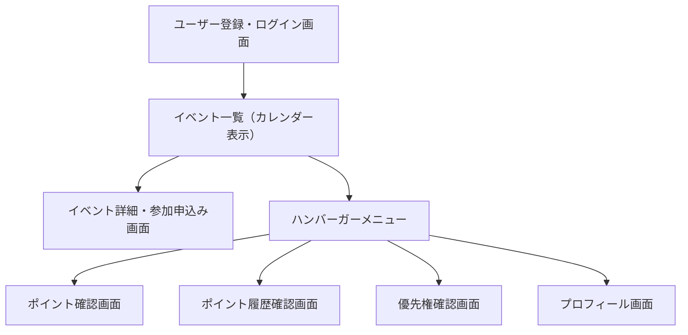
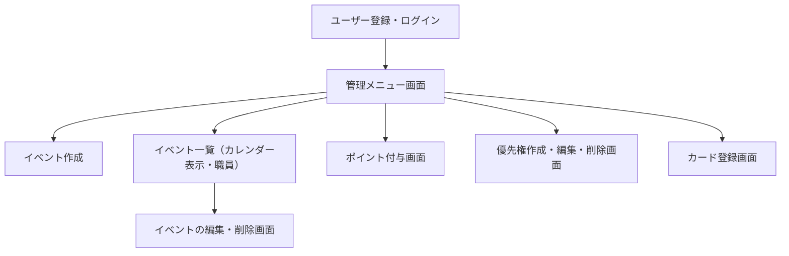

# PTA活動アプリ「ちょこっと」 画面設計書

## 1. 概要

このドキュメントは、保護者と職員それぞれのユーザーが操作する画面構成・遷移・要素などを整理した画面設計書です。  
スマホ（保護者）・PC（職員）での利用を想定しています。

---

## 2. 画面遷移図

画面同士のつながりを以下のようなフロー図で表現しています。  
※ 表示には [Mermaid対応ビューア](https://marketplace.visualstudio.com/items?itemName=bierner.markdown-mermaid) の利用をおすすめします。

---

### 保護者フロー（スマホ画面）

---

### 保育園職員フロー（PC画面）

---

## 3. 画面定義（主要画面）

※ 以下は一例です。必要に応じて詳細を追記・分割してください。

---

### ログイン画面 `/login`

| 項目         | 内容                         |
|--------------|------------------------------|
| ページ名     | ログイン                     |
| URL          | `/login`                     |
| 入力項目     | メールアドレス、パスワード  |
| ボタン       | ログイン                     |
| 遷移先       | `/`（保護者） / `/admin/menu`（職員） |
| 備考         | 未登録ユーザーは `/register` へ誘導 |

---

### イベント一覧（カレンダー表示） `/`

| 項目         | 内容                         |
|--------------|------------------------------|
| ページ名     | イベントカレンダー           |
| URL          | `/`                  |
| 表示内容     | 今月のイベント一覧（タップで詳細へ） |
| 遷移先       | `/events/[id]`               |

---

### イベント詳細・参加申込 `/events/[id]`

| 項目         | 内容                         |
|--------------|------------------------------|
| ページ名     | イベント詳細・参加申込       |
| URL          | `/events/[id]`               |
| 表示内容     | イベント名、日時、場所、持ち物、説明、参加ボタン |
| 遷移先       | `/`（申込完了後）    |

---

### 管理メニュー `/admin/menu`

| 項目         | 内容                         |
|--------------|------------------------------|
| ページ名     | 管理メニュー（職員）         |
| URL          | `/admin/menu`                     |
| 機能一覧     | イベント作成、編集、削除、ポイント付与、優先権管理、カード登録 |

---

## 4. 命名ルール・補足

- ファイル名やルーティングは **kebab-case**（例：`/event-detail`）を使用
- スマホ画面は主に保護者、PC画面は職員が操作
- イベントはカレンダー表示を基本とし、詳細・申込は個別ページへ遷移
- 登録・申込完了などの操作後は**前のページに戻すか完了画面を表示**

---

## 5. 添付画像（画面一覧）

### 保護者（スマホ画面）

1. ログイン画面  
   `docs/screens/parent-login.png`  
   

2. イベント一覧（カレンダー表示）  
   `docs/screens/parent-event-list.png`  
   

3. イベント詳細・参加申込  
   `docs/screens/parent-event-detail.png`  
   

4. メニュー（ハンバーガー）  
   `docs/screens/parent-menu.png`  
   

5. ポイント確認・優先権交換  
   `docs/screens/parent-point-exchange.png`  
   

6. ポイント履歴  
   `docs/screens/parent-point-history.png`  
   

7. 優先権確認  
   `docs/screens/parent-priority-rights.png`  
   

8. プロフィール  
   `docs/screens/parent-profile.png`  
   

---

### 保育園職員（PC画面）

1. ログイン画面  
   `docs/screens/admin-login.png`  
   

2. 管理メニュー（ダッシュボード）  
   `docs/screens/admin-dashboard.png`  
   

3. イベント作成  
   `docs/screens/admin-create-event.png`  
   

4. イベント一覧  
   `docs/screens/admin-event-list.png`  
   

5. イベント編集・削除  
   `docs/screens/admin-event-manage.png`  
   

6. ポイント付与  
   `docs/screens/admin-point-grant.png`  
   

7. 優先権管理（作成・編集・削除）  
   `docs/screens/admin-rewards-manage.png`  
   

8. クレジットカード登録  
   `docs/screens/admin-credit-card-payment.png`  
   

---
